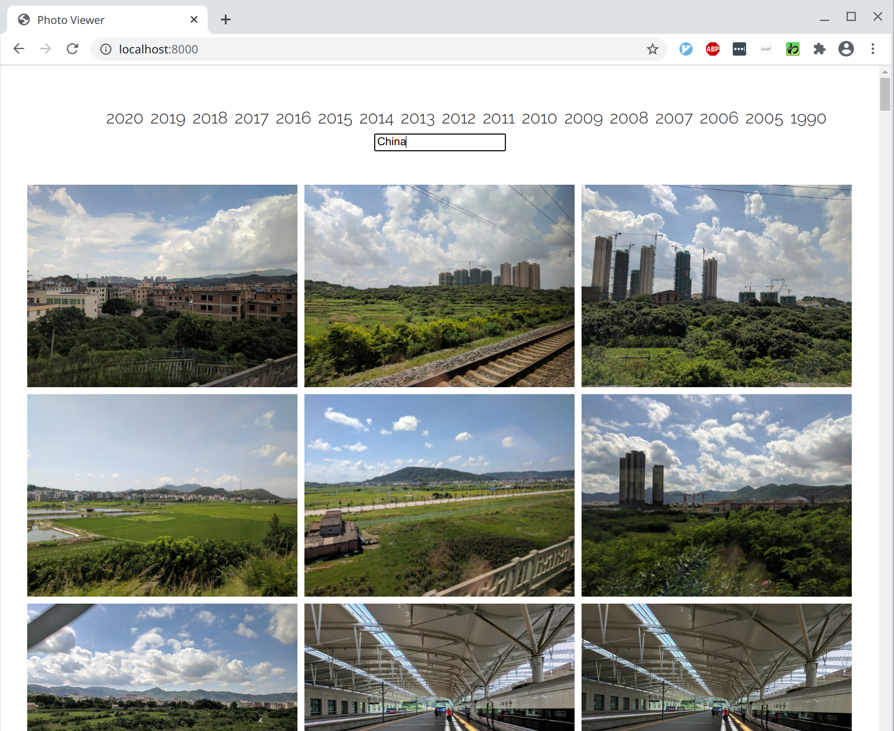

# Google Photos Clone for Amazon S3/Static Hosting

This has a collection of Python scripts, machine learning models, and hacky tricks to create a Google Photos style clone that does not require any server side backend -- it can be hosted as a static site, straight from Amazon S3 or equivalent.

## Setup
* Use chocolatey to install python
* Make a virtual environment: `python -m venv env`
* Activate in windows: `.\env\Scripts\activate`
* Install dependency requirements: `pip install -r requirements.txt`
* Update dependency requirements: `pip freeze > requirements.txt`

## Features

* Entirely statically generated and hosted (Just some Javascript, HTML and your images)
* Search/group by year photos were taken
* Infinite scroll like Google Photos

## Steps For Use

SETUP INSTRUCTIONS HERE

### Download Your Photos

Sync your photos into a `img` directory using the `sync_from_photos.py` script. This script will download images (and their metadata) from the specified Google Photos album. Here's an example command: 

```
python scripts\sync_from_photos.py --album-id "laksjhdlfkjhasdflkhjasdoiquwer_al"
```

This command may open up your web browser and ask for permissions to connect your Google Cloud Application to your google account. Make sure you pick the one that contains the pictures you want to sync.

### Generate Static Website

Call the `generate_photos_gallery.py` script, which will do the following:

* Generate thumbnails for your images
* Extract photo creation date from metadata
* Create a static website:

```
index.html
search-tokens.csv
photos.csv
img/ 
thumbnail/
js/
css/
```

Test to see if everything works:

```
python3 -m http.server 8000

# browse to http://localhost:8000/
```

### Synchronize Site To S3

S3 is a good place to synchronize all content...




## How does it work?

* Uses [Progressive Image Grid](https://github.com/schlosser/pig.js/) from schlosser for Google Photos like infinite scroll.
* Uses some badly written JQuery, avoiding all the npm Javascript crap.
* Downloads and uses a pre-built [Places365](http://places2.csail.mit.edu/) [PyTorch](https://pytorch.org) model for the machine learning image search
* Generates a big metadata csv file (image, aspect ratio, search tokens) that the Javascript frontend downloads and parses for search and image display.
* Built and run on Linux. Haven't tested it on MacOS or Windows, sorry.

## Scripts

* `scripts/trim.py` find and remove photos from your collection that don't meet a minimum size criteria (useful for removing existing thumnails)
* `scripts/sync_aws.sh` syncs everything to an Amazon S3 bucket. Every time you add more photos to your collection, just call this script and it'll sync everything for you.
* Want some password prection on your Amazon S3 site? Follow these instructions: http://kynatro.com/blog/2018/01/03/a-step-by-step-guide-to-creating-a-password-protected-s3-bucket/.


